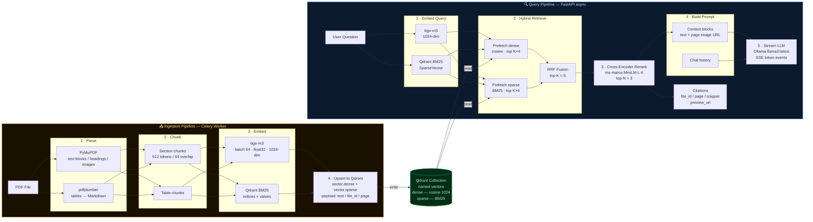

```mermaid
flowchart LR
    subgraph INGEST["📥 Ingestion Pipeline  —  Celery Worker"]
        direction TB

        PDF["PDF File"]

        subgraph PARSE["1 · Parse"]
            FITZ["PyMuPDF<br/>text blocks / headings / images"]
            PLUMBER["pdfplumber<br/>tables → Markdown"]
        end

        subgraph CHUNK["2 · Chunk"]
            SECTIONS["Section chunks<br/>512 tokens / 64 overlap"]
            TABLES["Table chunks"]
        end

        subgraph EMBED_I["3 · Embed"]
            DENSE_I["bge-m3<br/>batch 64 · float32 · 1024-dim"]
            SPARSE_I["Qdrant BM25<br/>indices + values"]
        end

        UPSERT["4 · Upsert to Qdrant<br/>vector.dense + vector.sparse<br/>payload: text / file_id / page"]

        PDF --> FITZ & PLUMBER
        FITZ & PLUMBER --> SECTIONS & TABLES
        SECTIONS & TABLES --> DENSE_I & SPARSE_I
        DENSE_I & SPARSE_I --> UPSERT
    end

    QDRANT[("Qdrant Collection<br/>named vectors<br/>dense  — cosine 1024<br/>sparse — BM25")]

    subgraph QUERY["🔍 Query Pipeline  —  FastAPI async"]
        direction TB

        Q["User Question"]

        subgraph EMBED_Q["1 · Embed Query"]
            DENSE_Q["bge-m3<br/>1024-dim"]
            SPARSE_Q["Qdrant BM25<br/>SparseVector"]
        end

        subgraph RETRIEVE["2 · Hybrid Retrieve"]
            PRE_D["Prefetch dense<br/>cosine · top K×4"]
            PRE_S["Prefetch sparse<br/>BM25 · top K×4"]
            RRF["RRF Fusion<br/>top-K = 5"]
            PRE_D & PRE_S --> RRF
        end

        RERANK["3 · Cross-Encoder Rerank<br/>ms-marco MiniLM-L-6<br/>top-N = 3"]

        subgraph PROMPT["4 · Build Prompt"]
            CTX["Context blocks<br/>text + page image URL"]
            HIST["Chat history"]
        end

        LLM["5 · Stream LLM<br/>Ollama llama3:latest<br/>SSE token events"]
        CITATIONS["Citations<br/>file_id / page / snippet<br/>preview_url"]

        Q --> DENSE_Q & SPARSE_Q
        DENSE_Q & SPARSE_Q --> PRE_D & PRE_S
        RRF --> RERANK
        RERANK --> CTX & CITATIONS
        CTX & HIST --> LLM
    end

    UPSERT -->|write| QDRANT
    QDRANT -->|read| PRE_D & PRE_S

    style INGEST  fill:#1a1000,stroke:#f59e0b,color:#fde68a
    style QUERY   fill:#0c1a2e,stroke:#3b82f6,color:#bfdbfe
    style QDRANT  fill:#052e16,stroke:#10b981,color:#a7f3d0
```
