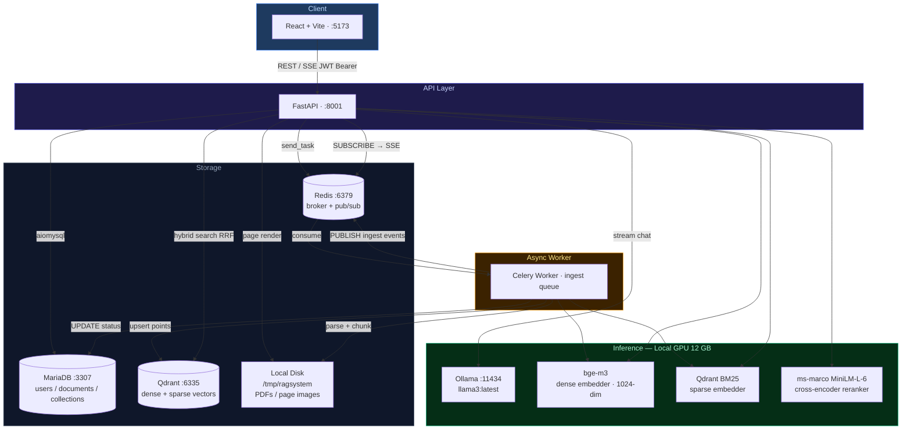

```mermaid
graph TB
    subgraph Client
        UI["React + Vite · :5173"]
    end

    subgraph API["API Layer"]
        FASTAPI["FastAPI · :8001"]
    end

    subgraph Worker["Async Worker"]
        CELERY["Celery Worker · ingest queue"]
    end

    subgraph Storage["Storage"]
        MARIADB[("MariaDB :3307<br/>users / documents / collections")]
        QDRANT[("Qdrant :6335<br/>dense + sparse vectors")]
        DISK["Local Disk<br/>/tmp/ragsystem<br/>PDFs / page images"]
        REDIS[("Redis :6379<br/>broker + pub/sub")]
    end

    subgraph Inference["Inference  — Local GPU 12 GB"]
        OLLAMA["Ollama :11434<br/>llama3:latest"]
        BGE["bge-m3<br/>dense embedder · 1024-dim"]
        BM25["Qdrant BM25<br/>sparse embedder"]
        RERANKER["ms-marco MiniLM-L-6<br/>cross-encoder reranker"]
    end

    UI -->|"REST / SSE  JWT Bearer"| FASTAPI

    FASTAPI -->|"aiomysql"| MARIADB
    FASTAPI -->|"page render"| DISK
    FASTAPI -->|"send_task"| REDIS
    REDIS -->|"consume"| CELERY
    CELERY -->|"PUBLISH ingest events"| REDIS
    FASTAPI -->|"SUBSCRIBE → SSE"| REDIS

    CELERY -->|"parse + chunk"| DISK
    CELERY --> BGE
    CELERY --> BM25
    CELERY -->|"upsert points"| QDRANT
    CELERY -->|"UPDATE status"| MARIADB

    FASTAPI --> BGE
    FASTAPI --> BM25
    FASTAPI -->|"hybrid search RRF"| QDRANT
    FASTAPI --> RERANKER
    FASTAPI -->|"stream chat"| OLLAMA

    style Client   fill:#1e3a5f,stroke:#3b82f6,color:#bfdbfe
    style API      fill:#1e1b4b,stroke:#6366f1,color:#c7d2fe
    style Worker   fill:#3b2200,stroke:#f59e0b,color:#fde68a
    style Storage  fill:#0f172a,stroke:#475569,color:#94a3b8
    style Inference fill:#052e16,stroke:#10b981,color:#a7f3d0
```
